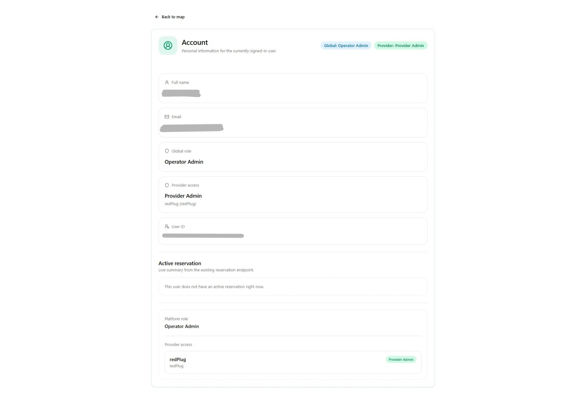
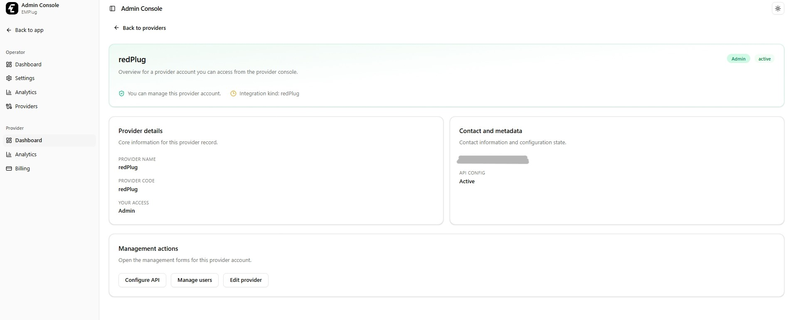
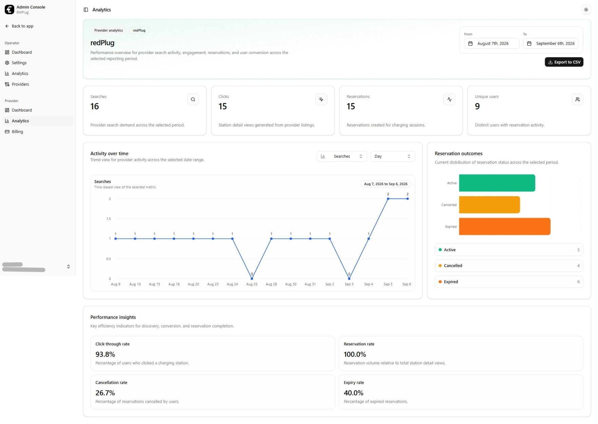
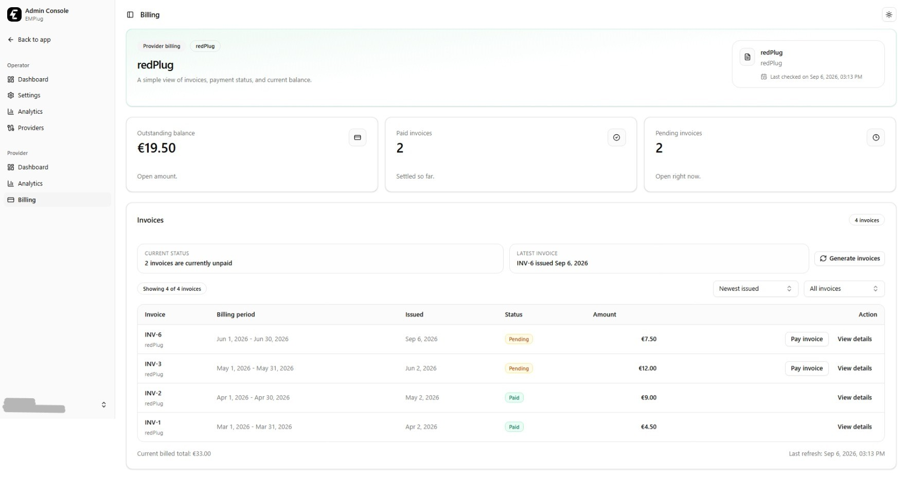
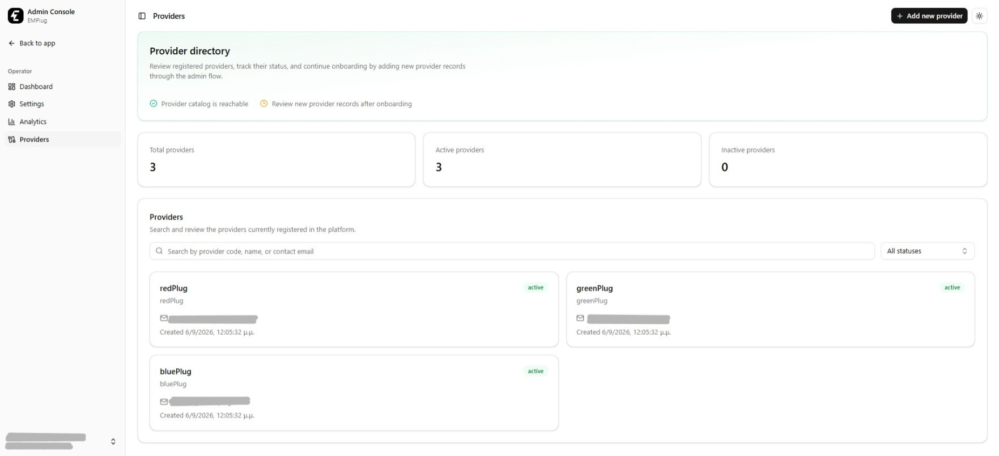
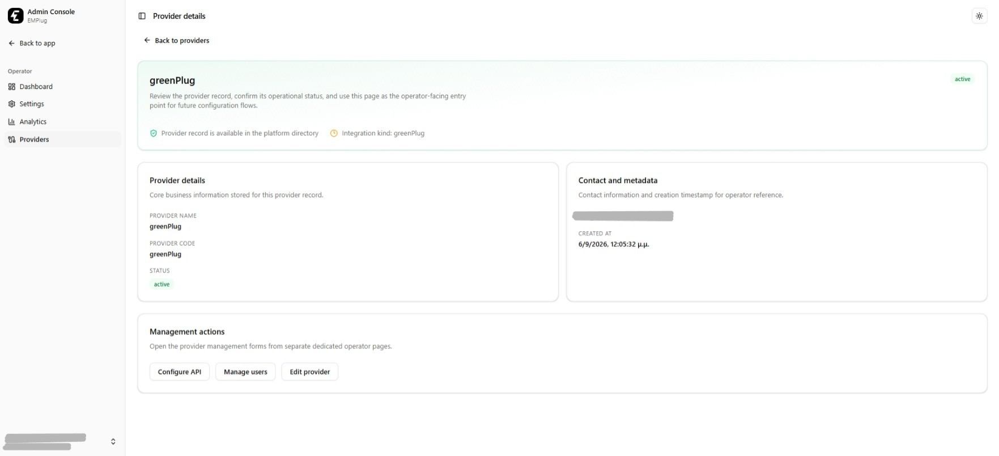
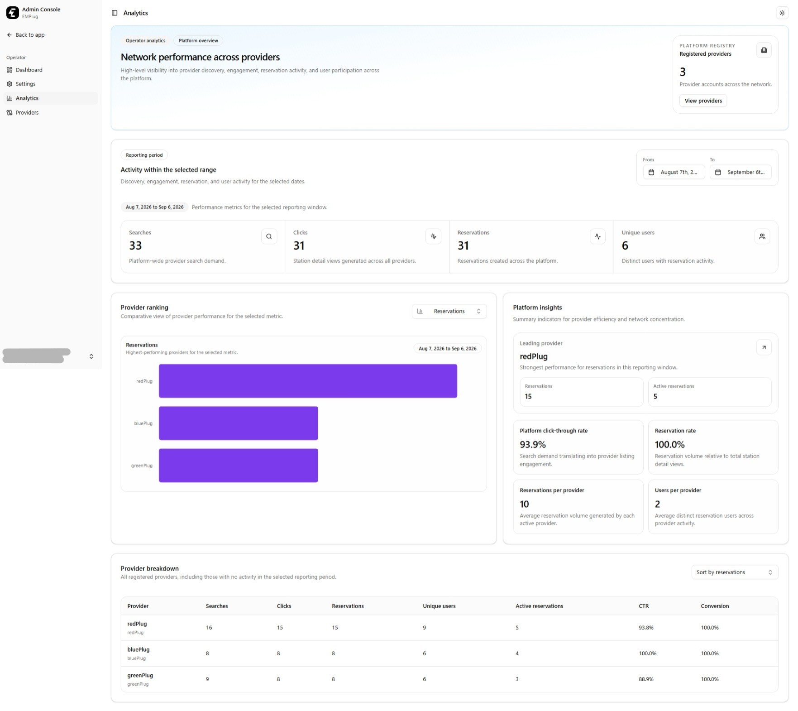
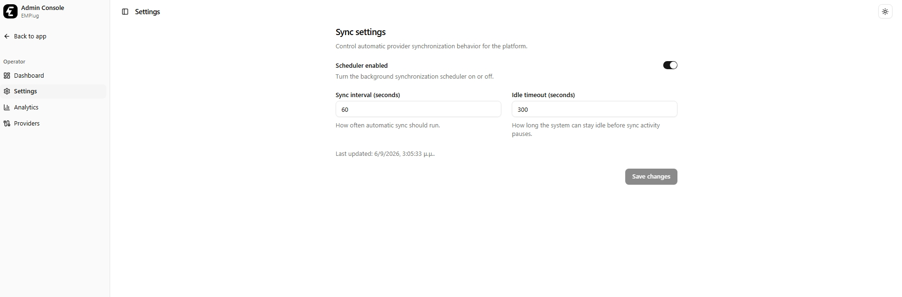
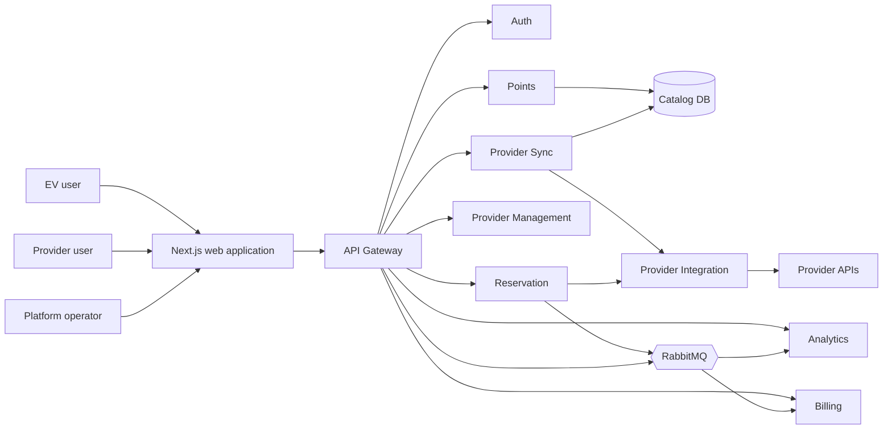
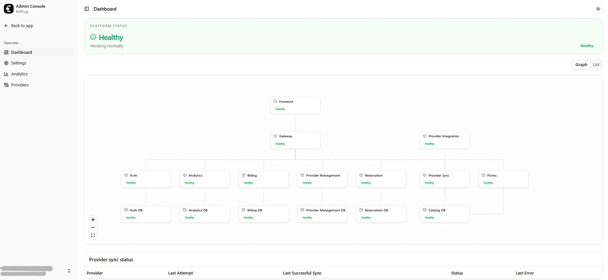

# EMPlug

**Every provider. One charging experience.**

A SaaS platform that brings EV charging networks, reservations, provider operations, analytics, and billing into one ecosystem.

**Next.js · React · TypeScript · FastAPI · PostgreSQL · RabbitMQ · Docker**

[Explore the Features](#features) · [User Roles](#user-roles) · [Architecture](#architecture)

---

## About the project

**EMPlug** is a multi-provider EV charging aggregation platform offered as Software as a Service. It gives electric vehicle drivers one place to discover, compare, and reserve charging points from different provider networks, removing the need to use a separate application for each operator.

EMPlug extends the ideas and user experience introduced in [**EMPower**](https://github.com/Argyexar/empower-showcase), evolving its single-provider charging application into a multi-provider SaaS ecosystem. It preserves the familiar map-based discovery and reservation flow while adding provider interoperability, centralized administration, analytics, billing, and event-driven services.

For charging providers, EMPlug supplies the customer-facing experience together with provider management, usage analytics, CSV exports, and billing tools. Platform operators receive a global view of providers, infrastructure health, synchronization activity, and usage across the ecosystem.

Developed for the **Software-as-a-Service Technologies course at the National Technical University of Athens (NTUA), 2025–2026**, EMPlug focuses on service boundaries, provider interoperability, asynchronous communication, isolated persistence, role-aware interfaces, and containerized deployment.

> **Note:** This repository is a public presentation of the EMPlug academic project. The implementation is intentionally not included.

## Features

### Discover charging points across providers

- **Unified interactive map:** Browse charging points aggregated from multiple provider networks in one interface.
- **Marker clustering:** Group nearby stations at lower zoom levels to keep large result sets readable and responsive.
- **Location search:** Search for places and addresses in Greece with autocomplete suggestions powered by OpenStreetMap's Nominatim service.
- **Current location:** Center the map on the driver's position through browser geolocation, when permission is granted.
- **Live availability:** Distinguish available, in-use, and offline charging points through map markers and station cards.
- **Directions:** Open Google Maps directions to a selected station.

### Compare stations and connectors

- Filter charging points by **current availability**, **fast-charging capability**, and **Type 2, CCS, or CHAdeMO** connector type.
- Sort visible stations by **proximity**, **price**, or **availability**.
- View the providers represented at each station.
- Inspect individual connectors with provider, status, maximum charging power, and price per kWh.
- Select a specific provider connector before creating a reservation.

### Sign in and reserve

EMPlug uses Google OAuth for user authentication. A reservation follows a short, guided flow:

1. Sign in with a Google account.
2. Search the combined charging network and select a station.
3. Choose an available connector from one of the supported providers.
4. Review the station, connector, power, price, and account information.
5. Confirm a 30-minute reservation.
6. Follow the remaining time from the header, reservation dialog, or account page.

The reservation service verifies the authenticated user, checks for an existing active reservation, validates that the provider is active, and delegates the request through the correct provider adapter. The resulting point state is synchronized back into the local catalog, while a reservation event feeds analytics and billing asynchronously.

### Manage an account

The account page brings together the signed-in user's profile, provider memberships, access level, and active reservation. Authentication state is shared across the customer and administration areas, with explicit handling for logout, expired sessions, and invalid tokens.

### Work across desktop and mobile

The driver interface adapts between a combined map-and-sidebar layout on desktop and switchable map/list views on smaller screens. Light, dark, and system themes apply consistently across the application and map.

## User roles

EMPlug provides role-aware experiences for three groups.

> **Demo account:** The screenshots use an account with both Platform Operator and Provider Admin access so that both administrative experiences can be presented. The interface is role-aware: users without operator privileges do not see operator sections, while provider users only see the providers and actions allowed by their assigned membership role.

### EV user

- Search and browse the aggregated charging network.
- Compare availability, compatibility, charging speed, and price.
- Authenticate securely through Google.
- Create and monitor an active charging-point reservation.
- Review account and reservation information.

### Charging provider

- Access a directory of the providers assigned to the current user.
- View provider profile, operational status, API configuration, and team membership.
- Give provider users **admin** or **viewer** access.
- Restrict management actions such as editing provider information, configuring an API, and managing users to provider administrators.

- Explore provider-specific searches, station views, reservations, unique users, reservation outcomes, and derived conversion metrics.
- Select date ranges and hourly, daily, weekly, or monthly analytics buckets.
- Export analytics time-series data as CSV.

- Review invoice totals, pending balances, paid invoices, billing periods, and detailed line items.

### Platform operator

- View the platform's services and databases as an interactive architecture graph or structured status list.
- Monitor overall health and identify healthy, degraded, or unavailable components.
- Inspect synchronization attempts, successful sync times, statuses, and provider errors.
- Browse, filter, add, activate, deactivate, and edit charging providers.
- Configure each provider's integration type, base URL, API key, and activation state.
- Assign and update provider administrators and viewers.

- View platform-wide usage totals, conversion metrics, provider rankings, and per-provider breakdowns.

- Control synchronization settings such as scheduler status, refresh interval, and idle timeout.

## Provider aggregation

Charging providers can expose different payload shapes and conventions. EMPlug isolates those differences behind provider adapters and converts them into a shared internal model.

| Stage | Responsibility |
| --- | --- |
| Provider configuration | Stores the provider identity, integration type, endpoint, credentials, and activation status. |
| Provider integration | Selects the appropriate adapter and normalizes point details and reservation responses. |
| Provider synchronization | Periodically fetches active providers and updates the local catalog cache. |
| Points service | Queries the normalized catalog using map bounds and driver-selected filters. |
| Reservation service | Routes a reservation to the provider that owns the selected connector. |

The implementation contains adapters for three provider contract variants: **redPlug**, **greenPlug**, and **bluePlug**. The rest of the platform works with one normalized representation instead of embedding provider-specific behavior into the user interface or business services.

## Architecture

The frontend communicates through a single **API Gateway**, which exposes the application API and routes requests to the appropriate service. Each backend service owns one focused capability:

| Service | Responsibility |
| --- | --- |
| `gateway` | Public entry point, request routing, authentication context, analytics event publishing, and dashboard health aggregation. |
| `auth` | Google OAuth, users, JWT issuance and validation, current-user information, and logout. |
| `provider-management` | Provider profiles, memberships, roles, and external API configuration. |
| `provider-integration` | Provider adapter selection and normalization of external point and reservation APIs. |
| `provider-sync` | Scheduled and manual synchronization of provider data into the local catalog. |
| `points` | Geographic search, filtering, station aggregation, and connector details. |
| `reservation` | Active-reservation rules, provider delegation, expiration, and reservation events. |
| `analytics` | Search, station-view, and reservation metrics for providers and operators. |
| `billing` | Billable reservation records, monthly invoices, invoice details, and payment status. |

### Event-driven flows

RabbitMQ decouples reservation processing from downstream reporting. A successful reservation publishes a `reservation.created` event that the analytics and billing services consume independently. Frontend search and station-view activity is also emitted as analytics events through the gateway.

Consumers use event identifiers and idempotency checks to prevent duplicate billing or analytics records when a message is delivered more than once. Reservation creation remains successful even if publishing the follow-up event temporarily fails, keeping the user-facing operation independent from reporting availability.

### Data ownership

EMPlug follows a database-per-bounded-context approach rather than sharing one application database.

| Data store | Owned data |
| --- | --- |
| Authentication database | Google identity, user profile, platform role, and login timestamps. |
| Provider-management database | Providers, provider-user memberships, and API configuration. |
| Catalog database | Normalized charging points, synchronization status, scheduler settings, and runtime state. |
| Reservation database | User reservations, provider references, status, and expiration details. |
| Analytics database | Searches, point views, reservation events, users, and event metadata. |
| Billing database | Billable events, pricing results, monthly invoices, line items, and payment state. |

The points service receives read-only access to catalog data, while the synchronization service owns catalog updates. This separation keeps service responsibilities explicit and limits cross-service database access.

### Operational visibility

The operator dashboard aggregates health checks from the platform services and their databases. It presents the deployment as both an interactive graph and a list, summarizes overall status, and combines this information with provider synchronization history. This makes the system's runtime architecture visible from within the product instead of limiting observability to container logs.

## Engineering details

- **Map-aware queries:** The client requests stations for the visible geographic bounds and adapts result limits according to the zoom level.
- **Normalized connector identities:** Connector identifiers retain their provider ownership so reservation requests can be routed correctly.
- **Adaptive synchronization:** Provider data can be refreshed manually or on a configurable schedule, with idle detection to reduce unnecessary work.
- **Resilient service calls:** Backend services communicate asynchronously through HTTP clients, validate downstream responses, and expose dependency-aware health checks.
- **Role-aware administration:** Operator access and provider membership determine which dashboards and management actions are available.
- **Usage instrumentation:** Searches, point views, and reservations feed both provider-level and platform-wide analytics.
- **Idempotent billing:** Unique event keys prevent the same reservation from producing duplicate billing records.
- **Interactive API documentation:** FastAPI services expose OpenAPI-based documentation for their HTTP interfaces.
- **Container isolation:** The web application, gateway, services, databases, and message broker run as separate Docker containers.

## Implementation scope

EMPlug implements multi-provider point discovery, Google authentication, reservation creation, provider administration, synchronization, analytics, billing records, and invoice views. A user can hold one active reservation, which expires automatically after its provider-defined or fallback duration.

In the current driver interface, **Charge now** and **Cancel reservation** are visible but intentionally report that the actions are unavailable. Invoice payment is represented by marking an invoice as paid inside the platform; no external payment gateway or physical charging infrastructure is controlled by this academic implementation.

## Technology stack

| Layer | Technologies |
| --- | --- |
| Web application | Next.js 16, React 19, TypeScript |
| Styling and components | Tailwind CSS 4, Radix UI / shadcn, Lucide icons |
| Maps and location | MapLibre GL, marker clustering, OpenStreetMap Nominatim, browser geolocation |
| Dashboards and charts | Recharts, React Flow, Dagre |
| Authentication | Google OAuth, JWT, PyJWT |
| API gateway and services | Python, FastAPI, Pydantic, Uvicorn, HTTPX |
| Persistence | PostgreSQL 17, SQLAlchemy, psycopg |
| Asynchronous messaging | RabbitMQ, aio-pika |
| Deployment | Docker, Docker Compose |
| Verification | PowerShell smoke tests for authentication, provider management, and analytics flows |

## Academic context

**Team:** saas26-20

**Course:** Software-as-a-Service Technologies, 2025–2026

**Institution:** School of Electrical and Computer Engineering, National Technical University of Athens

EMPlug combines SaaS product design, microservice architecture, external API integration, event-driven communication, service-owned persistence, role-based administration, observability, analytics, billing, and containerized deployment in one platform.
